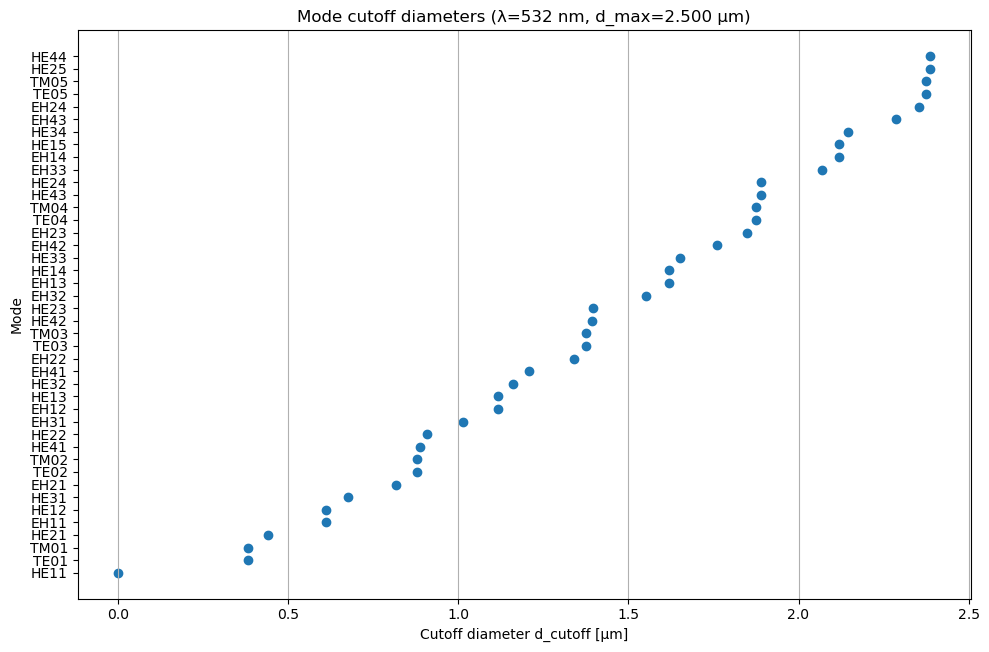
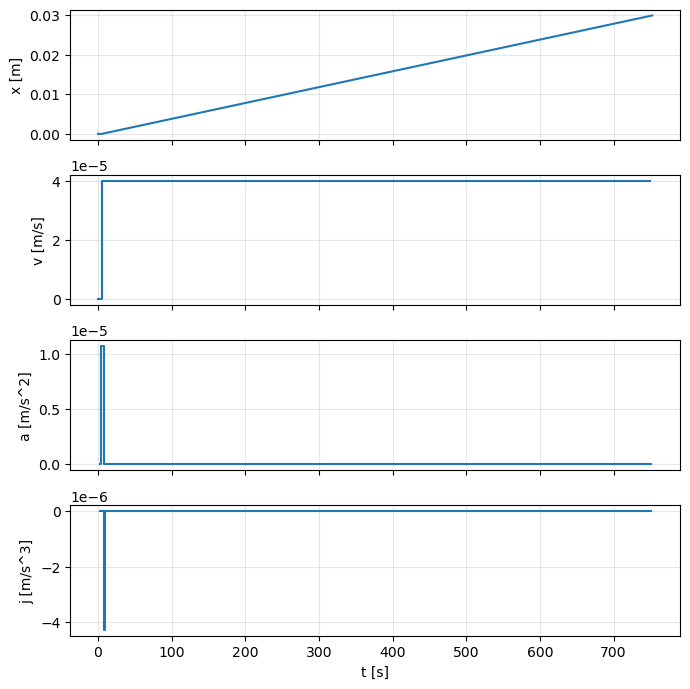
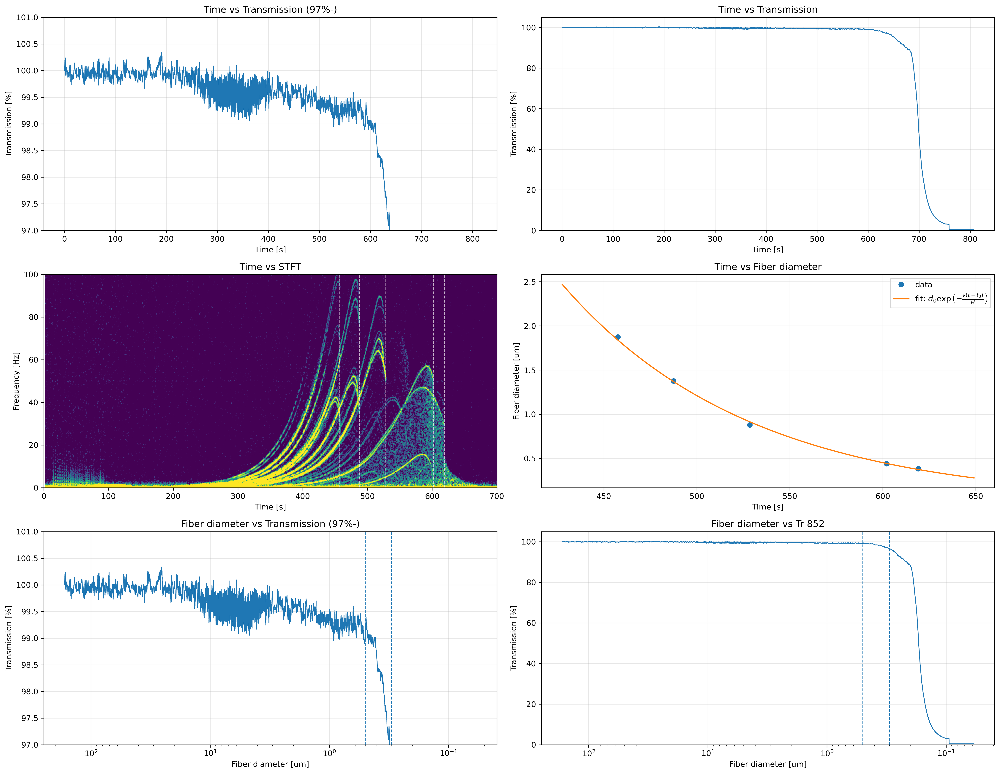

# Heater Puller Analysis Toolkit

## Overview

Python toolkit developed for tapered optical fiber fabrication research.

This project was used to support the design, fabrication, and analysis of optical fiber tapers created with a heater-puller system.

## Features

- Guided-mode cutoff diameter calculation
- Taper profile generation
- Motion parameter generation for fabrication processes
- Experimental transmission analysis
- STFT-based signal analysis
- CSV / NPZ data export

## Example Outputs

### Guided-mode cutoff calculation



### Heater-puller motion profile



### Experimental transmission analysis



## Technologies

- Python
- NumPy
- SciPy
- Pandas
- Matplotlib
- Jupyter Notebook

## Setup

```bash
pip install -r requirements.txt
```

## Usage

Open the notebooks in order:

1. `notebooks/01_cutofftable.ipynb`
2. `notebooks/02_makeprofile.ipynb`
3. `notebooks/03_analysis.ipynb`

Notebook roles:

- `01_cutofftable.ipynb`: calculates cutoff diameters for guided modes in a circular step-index fiber.
- `02_makeprofile.ipynb`: generates heater-puller motion profiles and taper-diameter estimates.
- `03_analysis.ipynb`: analyzes experimental transmission data with STFT and estimates taper diameter evolution.

Example outputs:

- `examples/cutoff_table_example.csv`: output from `01_cutofftable.ipynb`.
- `examples/profile/`: motion profile outputs from `02_makeprofile.ipynb`.
- `examples/analysis_result_example.xlsx`: processed analysis workbook from `03_analysis.ipynb`.
- `images/`: representative plots generated from the notebooks.

Raw pull measurements and additional local analysis outputs are intentionally excluded from Git.

## Repository Structure

```text
README.md
notebooks/
    01_cutofftable.ipynb
    02_makeprofile.ipynb
    03_analysis.ipynb
src/
    methods.py
    const.py
examples/
    cutoff_table_example.csv
    analysis_result_example.xlsx
    profile/
        exp_60mm_80umps.npz
        exp_60mm_80umps.taper
images/
    cutoff_plot.png
    profile_plot.png
    analysis_summary_plot.png
```

## Research Context

This software was developed as part of research involving tapered optical fibers and optical mode control.

The repository demonstrates:

- Numerical analysis
- Scientific computing
- Experimental data processing
- Research software development
- Reproducible computational workflows

## Portfolio Notes

This project is representative of research-oriented Python development and scientific data analysis workflows.

## License

This project is released under the MIT License.
